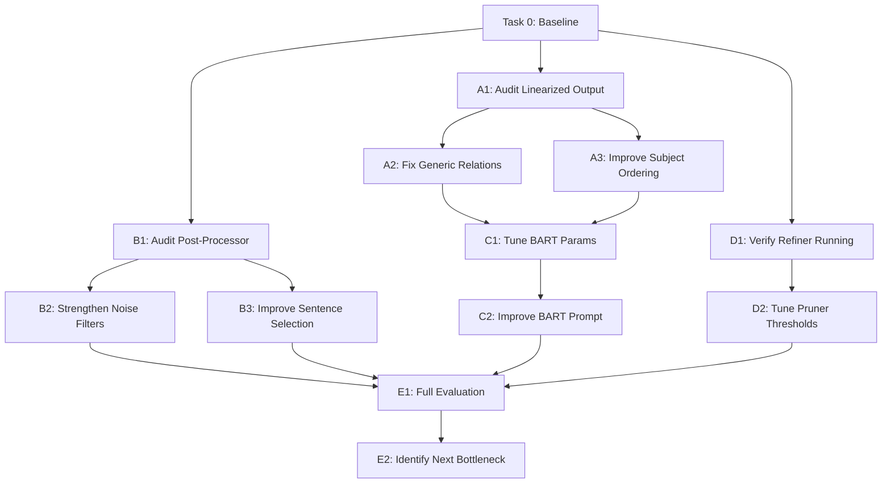

# Phase 1 — Summary Quality & Evaluation Scores (P0 + P1)

## Objective

Incrementally improve the **KG-based unified summary** quality and raise evaluation metrics to target levels, without modifying architecture or breaking existing pipelines.

> [!IMPORTANT]
> Every task is **atomic and reversible** — a single focused change, tested against ground truth before and after. No task depends on another unless explicitly stated.

---

## Current Pipeline (Summary Path Only)


Each task below targets a **specific stage** in this pipeline.

---

## Pre-Requisite: Baseline Measurement

### Task 0 — Record Current Baseline Scores

**Goal:** Establish exact current metric scores for all 21 ground-truth topics so every subsequent change can be objectively measured.

**What to do:**
1. Create a script `backend/eval_baseline.py` that:
   - Takes a session ID and a ground-truth summary file path
   - Loads the KG-based fused summary from `outputs/{session_id}/fused_kg/fused_summary.txt`
   - Runs `evaluate_summaries()` against the ground-truth
   - Prints and saves results as JSON
2. Run it on at least **3 representative sessions** where you already have processed outputs
3. Record baseline in a table

**Verification:**
- Script runs without errors
- JSON results are saved with all 5 metrics (ROUGE-1, ROUGE-L, Keyword Coverage, BERTScore, Cosine Sim)
- Numbers serve as the reference point for all subsequent tasks

**Files:** `[NEW] backend/eval_baseline.py`

---

## Stage A: Linearization Quality (Source of Truth for Everything Downstream)

> The linearizer converts the KG graph into text. If this text is bad, nothing downstream can fix it.

### Task A1 — Audit Linearized Output

**Goal:** Understand what the linearizer currently produces, diagnose specific problems.

**What to do:**
1. Add logging to `StructuralKGSummarizer.summarize()` in [kg_summarizer.py](file:///f:/FYP/kg/backend/kg_summarizer.py) to save intermediate outputs:
   - Save linearized text to `outputs/{session_id}/graphs/debug_linearized.txt`
   - Save refined text to `outputs/{session_id}/graphs/debug_refined.txt`
   - Save pre-BART text to `outputs/{session_id}/graphs/debug_pre_bart.txt`
2. Run on 2-3 sessions and manually inspect each stage

**Verification:**
- Debug files are created at each stage
- Manual inspection identifies which stage introduces the most noise/quality loss
- A brief note (1-2 sentences) is written documenting the finding

**Files:** `[MODIFY]` [kg_summarizer.py](file:///f:/FYP/kg/backend/kg_summarizer.py) — add debug saves inside `summarize()`

---

### Task A2 — Fix Generic "is related to" Fallback in Linearizer

**Goal:** The linearizer defaults to "is related to" when it doesn't find a specific verb. This produces vague, uninformative sentences. Reduce these generic relations.

**What to do:**
1. In [kg_summarizer.py](file:///f:/FYP/kg/backend/kg_summarizer.py) `linearize()`, expand the list of normalized generic relations that get downgraded
2. Add a verb normalization map (e.g., `"has"` → keep, `"relates"` → downgrade, `"involves"` → keep)
3. When no specific verb exists, try using node description text to infer a better relation
4. If truly no relation is available, suppress the triple rather than outputting generic filler

**Verification:**
- Count of "is related to" sentences in linearized output drops by >50%
- Re-run evaluation: ROUGE-1 should not decrease (may increase)
- Manually inspect 2-3 outputs to confirm sentences are more specific

**Files:** `[MODIFY]` [kg_summarizer.py](file:///f:/FYP/kg/backend/kg_summarizer.py#L272-L423) — `linearize()` method

---

### Task A3 — Improve Subject Ordering in Linearizer

**Goal:** Sentences currently follow centrality order only, which doesn't match educational/logical flow. Add prerequisite-awareness.

**What to do:**
1. In `linearize()`, after sorting by centrality, apply a secondary sort:
   - Definitions/intro concepts first (nodes that are targets of "is a", "is defined as", etc.)
   - Properties/operations next (nodes with action verbs)
   - Examples/relationships last
2. Use the same discourse classification patterns already in [narrative_restructurer.py](file:///f:/FYP/kg/backend/narrative_restructurer.py#L29-L74) `DISCOURSE_ORDER`

**Verification:**
- Compare linearized text before/after on 2 sessions — ordering should feel more logical
- ROUGE-L should increase (structural alignment with reference improves)
- No regressions in ROUGE-1 or Keyword Coverage

**Files:** `[MODIFY]` [kg_summarizer.py](file:///f:/FYP/kg/backend/kg_summarizer.py#L272-L423) — `linearize()`

---

## Stage B: Post-Processing Quality (Noise Removal & Sentence Selection)

### Task B1 — Audit Post-Processor Output

**Goal:** Identify what noise survives the current `clean_and_constrain_summary()` pipeline.

**What to do:**
1. Save pre-post-processing and post-post-processing text to debug files (similar to A1)
2. Manually inspect: which noise sentences survive? Which good sentences are dropped?
3. Classify surviving noise into categories:
   - OCR artifacts (single letters, gibberish)
   - CNN/DailyMail hallucinations (BART training data leakage)
   - Circular/trivial statements
   - Fragments without verbs

**Verification:**
- Debug files saved and inspected
- A categorized list of noise types is produced (informal, 5-10 items)

**Files:** `[MODIFY]` [kg_summarizer.py](file:///f:/FYP/kg/backend/kg_summarizer.py) — add debug save in `summarize()`

---

### Task B2 — Strengthen Noise Filters in Post-Processor

**Goal:** Eliminate surviving noise based on Task B1 findings.

**What to do (based on B1 findings, pick relevant items):**
1. In [summary_postprocessor.py](file:///f:/FYP/kg/backend/summary_postprocessor.py):
   - Add CNN/DailyMail artifact patterns to `_CNN_ARTIFACT_PATTERNS` (if missing)
   - Strengthen `_is_noise_sentence()` for OCR letter-fragments (e.g., sentences < 5 words where >30% are single characters)
   - Add minimum information density check (sentence must have ≥2 content words — nouns/verbs)
2. Keep all existing patterns — only add new ones

**Verification:**
- Re-run on same sessions as B1 — noise sentences should be eliminated
- Count of sentences flagged as noise should increase
- ROUGE-1 and BERTScore should not decrease (removing noise should help or be neutral)

**Files:** `[MODIFY]` [summary_postprocessor.py](file:///f:/FYP/kg/backend/summary_postprocessor.py)

---

### Task B3 — Improve Sentence Selection (Informativeness Scoring)

**Goal:** When constrained to 7-10 sentences, the post-processor should keep the most informative ones, not just the first ones.

**What to do:**
1. In `_score_sentence_informativeness()` in [summary_postprocessor.py](file:///f:/FYP/kg/backend/summary_postprocessor.py#L230-L278):
   - Boost sentences with definition patterns (already partially there)
   - Boost sentences with specific technical terms (multi-word nouns like "linked list", "concurrent access")
   - Penalize sentences that repeat subjects already covered in higher-scoring sentences
2. Ensure that `clean_and_constrain_summary()` uses scores to select top-k, not just order

**Verification:**
- Compare selected sentences before/after on 2 sessions
- Keyword Coverage should increase (more informative sentences retained)
- BERTScore should increase or hold steady

**Files:** `[MODIFY]` [summary_postprocessor.py](file:///f:/FYP/kg/backend/summary_postprocessor.py#L230-L278)

---

## Stage C: BART Summarization Tuning

### Task C1 — Tune BART Parameters for KG Input

**Goal:** BART's `max_length`, `min_length`, `num_beams`, `length_penalty` settings may not be optimal for KG-linearized text (which is already structured, unlike typical articles).

**What to do:**
1. In [kg_summarizer.py](file:///f:/FYP/kg/backend/kg_summarizer.py) `summarize()` method, in the BART call (around line 477):
   - Test `length_penalty` values: 1.0, 1.5, 2.0 (higher = longer output)
   - Test `no_repeat_ngram_size`: 2 vs 3 (3 forces more diverse content)
   - Test `num_beams`: 4 vs 6 (more beams = better but slower)
2. Run each configuration against 3 ground-truth topics, record metrics
3. Pick the best configuration

**Verification:**
- At least 3 configurations tested
- Metrics table comparing each configuration
- Best config applied, with measurable improvement in at least one metric

**Files:** `[MODIFY]` [kg_summarizer.py](file:///f:/FYP/kg/backend/kg_summarizer.py#L469-L481) — BART generation params in `summarize()`

---

### Task C2 — Improve BART Prompt Wrapper

**Goal:** The prompt wrapper before BART is generic. A more specific prompt can guide BART to produce better summaries.

**What to do:**
1. In `summarize()`, replace the current generic prompt:
   ```
   "Provide a comprehensive summary of the following knowledge graph facts..."
   ```
   with a more specific instructional prompt that:
   - Encourages defining key terms
   - Asks for logical ordering (definitions → properties → relationships)
   - Discourages repeating the same entity multiple times
2. Test 2-3 prompt variants

**Verification:**
- Compare outputs for same input with different prompts
- Select prompt that produces highest average ROUGE-1 across 3 test topics
- Keyword Coverage should improve (more relevant terms used)

**Files:** `[MODIFY]` [kg_summarizer.py](file:///f:/FYP/kg/backend/kg_summarizer.py#L469-L477) — prompt wrapper in `summarize()`

---

## Stage D: Refinement Pipeline (Structure-Aware Reconstruction)

### Task D1 — Verify Refiner Is Actually Running

**Goal:** Confirm that `FusedSummaryRefiner` and its sub-components (`TrivialStatementPruner`, `RoleConsistencyValidator`, `ConceptMemory`) are all executing without silent failures.

**What to do:**
1. Add print/logging to [summary_refiner.py](file:///f:/FYP/kg/backend/summary_refiner.py) `FusedSummaryRefiner.refine()` to log:
   - Number of input sentences
   - Number of trivial statements pruned
   - Number of role-inconsistent sentences removed
   - Number of concept duplicates removed
   - Number of output sentences
2. Check if any `except` blocks silently swallow errors

**Verification:**
- Run on 2 sessions, confirm refiner logs show actual work being done
- If refiner is silently failing → identified root cause for future fix
- If working → confirmed, proceed to D2

**Files:** `[MODIFY]` [summary_refiner.py](file:///f:/FYP/kg/backend/summary_refiner.py#L442-L492) — `refine()` method

---

### Task D2 — Tune Trivial Statement Pruner Thresholds

**Goal:** The `TrivialStatementPruner` uses `similarity_threshold=0.85` for detecting "X is X" statements. This may be too aggressive or too lenient.

**What to do:**
1. Based on D1 logs, check:
   - Are too many valid sentences being pruned? → Lower threshold
   - Are trivial statements surviving? → Add more detection patterns
2. Test thresholds: 0.80, 0.85, 0.90
3. Add detection for common KG-specific trivial patterns:
   - "[Entity] is a type of [Entity]" where both refer to the same concept
   - "[Entity] has [Entity]" where object is just a restated subject

**Verification:**
- Log shows changed prune count
- No valid informative sentences are incorrectly pruned
- At least 1 metric improves or holds steady

**Files:** `[MODIFY]` [summary_refiner.py](file:///f:/FYP/kg/backend/summary_refiner.py#L108-L205)

---

## Stage E: End-to-End Evaluation & Iteration

### Task E1 — Full Evaluation Run After All Changes

**Goal:** Comprehensive comparison of before (Task 0 baseline) and after all applied tasks.

**What to do:**
1. Re-run `eval_baseline.py` on same sessions with same ground truth
2. Produce a before/after comparison table
3. Calculate average improvement across all metrics

**Verification:**
- All 5 metrics reported for each session
- At least 3 metrics show improvement over baseline
- No metric has regressed by more than 5%

**Files:** `[MODIFY]` `backend/eval_baseline.py` — add comparison mode

---

### Task E2 — Identify Next Bottleneck

**Goal:** After Phase 1 improvements, identify which pipeline stage now limits quality most.

**What to do:**
1. Using debug files from A1/B1, inspect which stage introduces the most remaining noise or loses the most information
2. Classify remaining issues into categories
3. Write a brief finding (3-5 sentences) to inform Phase 2 planning

**Verification:**
- Finding documented
- Clear recommendation for Phase 2 priority

**Files:** None — analysis only

---

## Task Dependency Graph



> [!TIP]
> **Recommended execution order:** T0 → A1 + B1 + D1 (parallel audits) → A2 → A3 → B2 → B3 → C1 → C2 → D2 → E1 → E2

---

## Metric Targets (Phase 1 End)

| Metric | Baseline (current) | Phase 1 Target | SPEC Target |
|--------|-------------------|----------------|-------------|
| Keyword Coverage | TBD (Task 0) | +15-20% | 80–90% |
| Cosine Similarity | TBD (Task 0) | +10-15% | 80–90% |
| BERTScore F1 | TBD (Task 0) | +10-15% | > 50–60% |
| ROUGE-1 F1 | TBD (Task 0) | +10-15% | > 50–60% |
| ROUGE-L F1 | TBD (Task 0) | +10% | > 40–50% |

> [!NOTE]
> Phase 1 may not reach final SPEC targets. The goal is measurable, significant improvement. Phase 2 will build on remaining gaps.

---

## Constraints Checklist (Every Task Must Pass)

- [ ] Existing pipelines remain functional
- [ ] Change is incremental (< 50 lines per task)
- [ ] Change is reversible (can be reverted without side effects)
- [ ] No new external dependencies
- [ ] Verified against ground truth before and after
